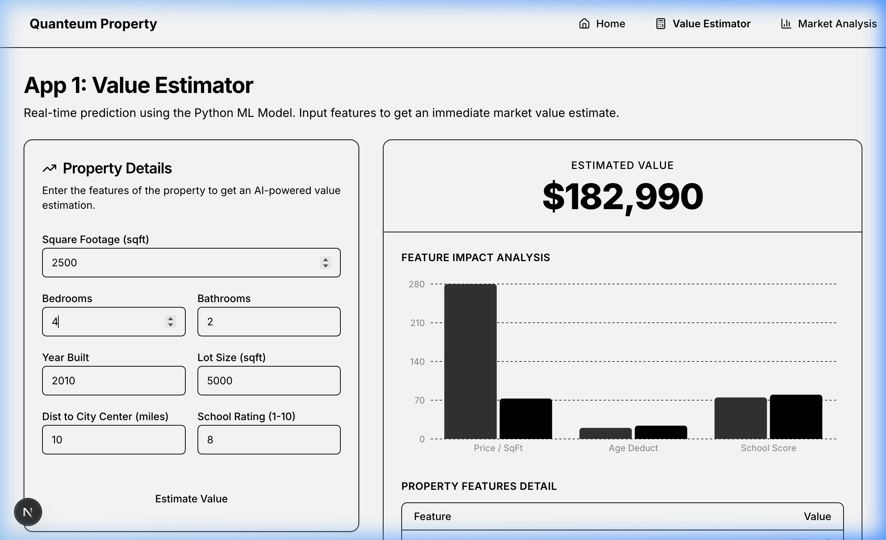
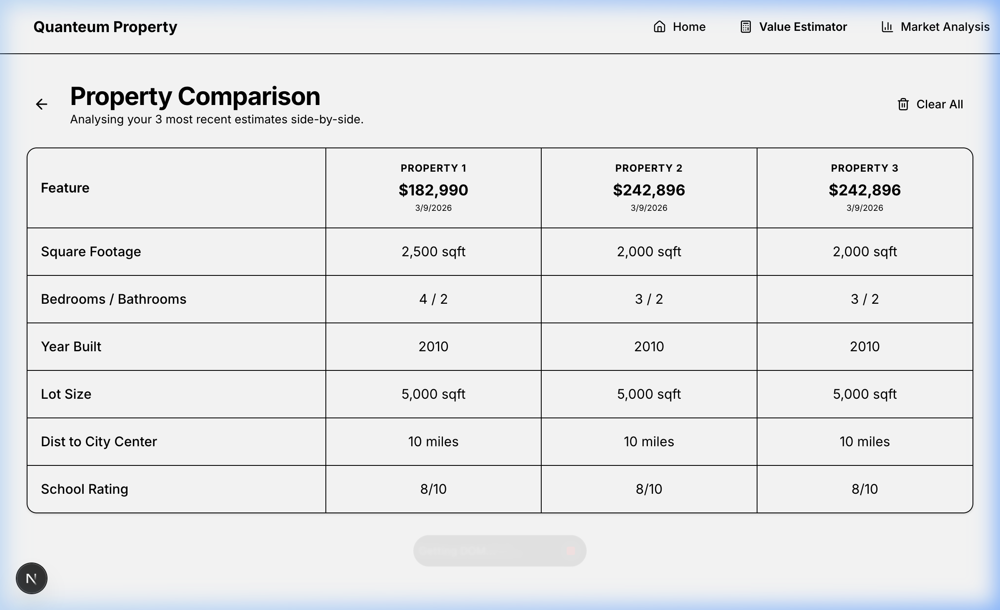
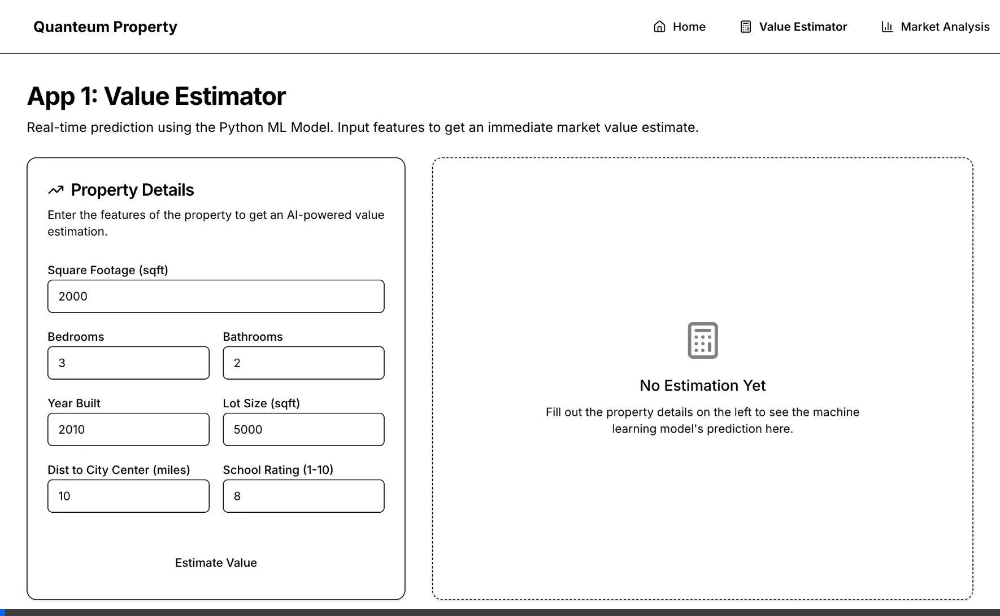
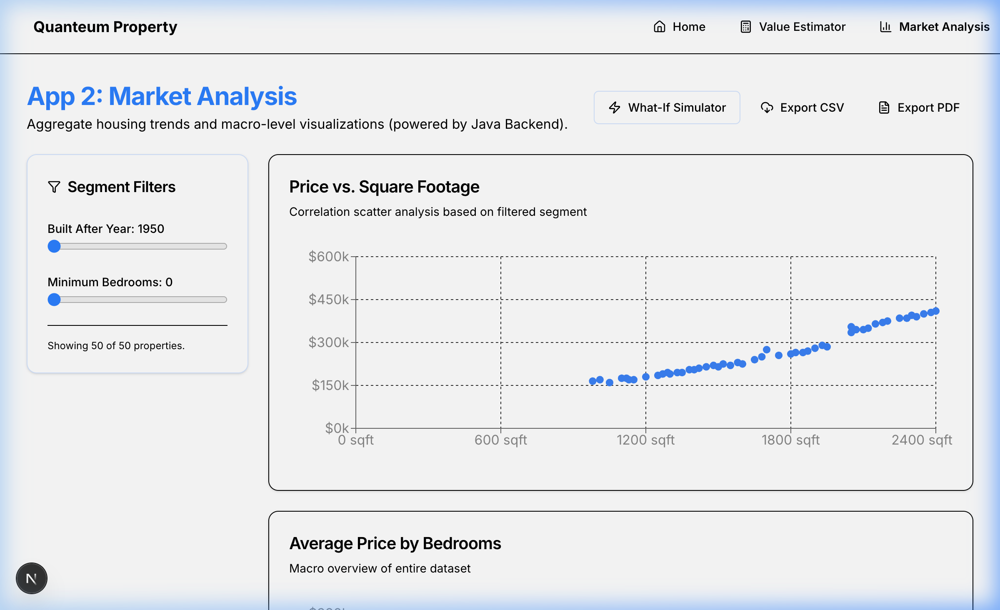
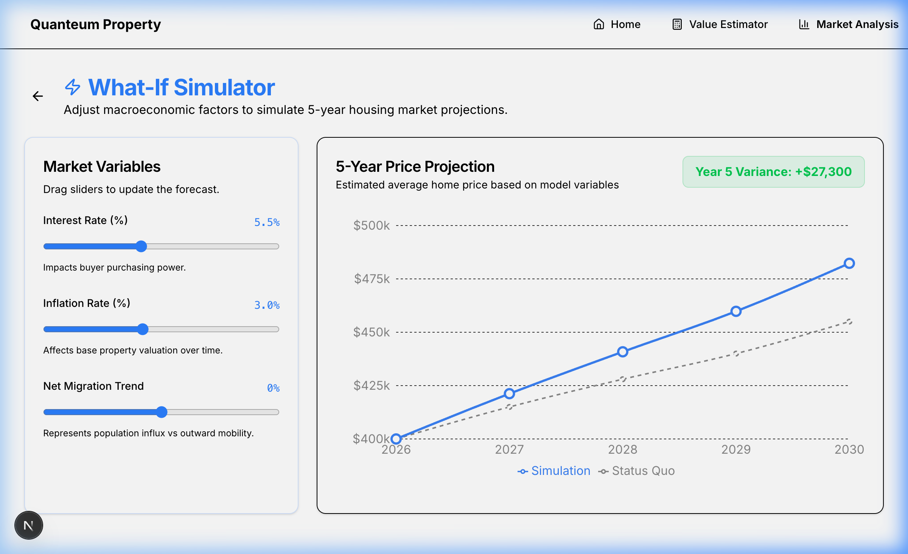
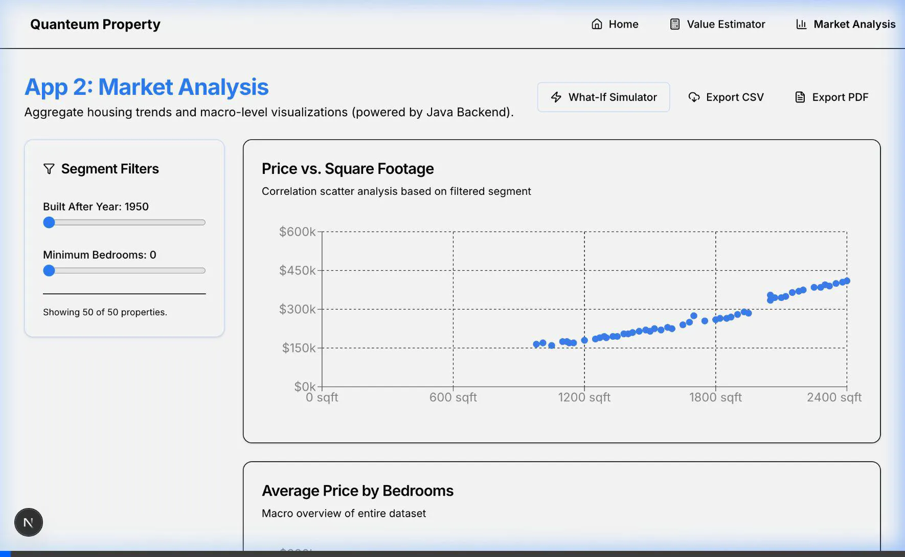

# Quanteum Property Portal — Feature Demonstration

This document showcases the features implemented in the Quanteum Property Portal, including screenshots and recordings of both applications in action.

## App 1 — Property Value Estimator

The Property Value Estimator allows users to input various property features to get an AI-driven price prediction.

### 1. Estimating a Property Value
Users fill out a form with details such as square footage, bedrooms, bathrooms, and location details. Upon clicking **Estimate Value**, the Python Machine Learning API is queried to predict the property's price. The results are displayed along with a chart detailing the impact of different features.

### 2. Side-by-Side Comparison
The platform saves a history of estimates locally, allowing users to compare properties side-by-side. The comparison table makes it easy to evaluate how different attributes like lot size or school rating affect the final price calculation.

*Watch the full App 1 interaction:*

---

## App 2 — Property Market Analysis

The Property Market Analysis application provides a comprehensive dashboard for exploring and projecting real estate trends, powered by the Java Spring Boot backend.

### 1. Market Dashboard
The dashboard visualizes market data using interactive charts (e.g., Price vs. Square Footage, Distribution by Bedrooms) and a sortable data table. Users can apply filters and export the data to CSV or PDF for offline analysis.

### 2. What-If Simulator
The What-If Simulator allows users to adjust macroeconomic variables like interest rates, inflation, and migration trends. The interactive sliders immediately recalibrate a 5-year price projection chart based on the selected factors.

*Watch the full App 2 interaction:*

