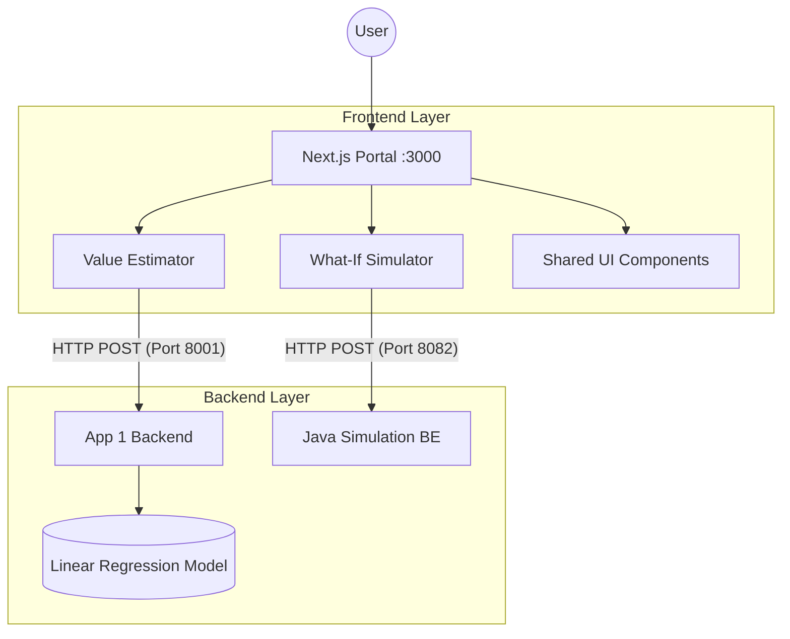

# Quanteum Property Portal: Comprehensive System Guide

This project is a unified ecosystem for real estate analytics, consisting of a modern Next.js frontend and dedicated Python & Java micro-services.

---

## 🏗️ System Architecture

The system follows a **decoupled micro-services architecture** where the frontend acts as the orchestrator for multiple independent backend services.



---

## 🖥️ Frontend: The Housing Portal (`housing-portal`)

Built with **Next.js 14+ (App Router)** and **TypeScript**.

### Key Features:
- **Value Estimator:** Predicts property prices using the Python ML backend.
- **What-If Simulator:** Visualizes 5-year market projections using the Java backend.
- **Side-by-Side Comparison:** Compares saved estimates from `localStorage`.

---

## 🐍 Backend 1: App 1 Service (`app1-backend`)

A **FastAPI (Python)** service providing an interface for the Linear Regression model.
- **Endpoint:** `POST /predict`
- **Logic:** Loads `model.joblib` and runs inference via Pandas and Scikit-learn.

---

## ☕ Backend 2: App 2 Service (`housing_app`)

A robust **Spring Boot (Java 25)** microservice that mirrors the frontend requirements exactly.

### 1. Typesafe Communication (DTOs)
We use explicit Data Transfer Objects (DTOs) to ensure the Java service perfectly matches the frontend's expectations:

| Frontend (TypeScript) | Backend (Java Record) |
| :--- | :--- |
| `interface SimulationParams` | `record SimulationRequest` |
| `interface SimulationResult` | `record SimulationResponse` |

### 2. Simulation Logic (`SimulatorController.java`)
- Handles `POST` requests at `/api/simulate`.
- Calculates 5-year price projections based on **Interest Rates**, **Inflation**, and **Migration Trends**.
- **CORS Enabled:** Specifically configured to allow requests from `http://localhost:3000`.

---

## 🔗 The Connection: How They Talk

The bridge is located in **[`housing-portal/lib/api.ts`](file:///Users/alimmohammad/Desktop/Quanteum%20Assignment/housing-portal/lib/api.ts)**.

1.  **Preparation:** The frontend packs validated data into JSON.
2.  **Request:** Uses the native `fetch` API to send asynchronous `POST` requests.
3.  **Real-Time Update:** The What-If Simulator uses a 300ms debounce to send live updates to the Java service as you adjust sliders.

---

## 🚀 Execution Guide

You can start all three services with a single command:

```bash
# From the project root
./run_all.sh
```

**What this script does:**
1. Kills any existing processes on ports 3000, 8001, and 8082.
2. Starts the **Python ML API**, **Java Backend**, and **Next.js Frontend** in the background.
3. Creates a `logs/` folder in the project root to store output from all three services (`frontend.log`, `python_api.log`, `java_backend.log`).

To monitor logs in real-time, use:
`tail -f logs/frontend.log` (substitute with the log you want to see)

---

### Manual Startup Option

Alternatively, open three separate terminal windows:

| Service | Location | Command | Port |
| :--- | :--- | :--- | :--- |
| **Portal** | `housing-portal/` | `npm run dev` | 3000 |
| **App 1 BE** | `app1-backend/` | `uvicorn main:app --port 8001 --reload` | 8001 |
| **App 2 BE** | `housing_app/` | `./gradlew bootRun` | 8082 |
| **Model BE** | `Linear Regression.../` | `uvicorn app:app --port 8000 --reload` | 8000 |
