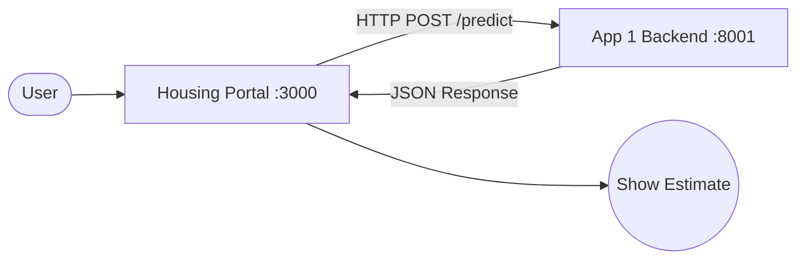

# System Architecture: Housing Portal & App 1 Backend

This document outlines how the **Housing Portal** (Frontend) and **App 1 Backend** (Service) work together.

## 🏗️ The Components

### 1. Housing Portal (`housing-portal`)
- **Type:** Next.js Web Application (React).
- **Port:** `3000`.
- **Role:** The user interface. It contains two applications (Value Estimator and What-If Simulator) and a shared design system.
- **Key File:** `lib/api.ts` — This is the "bridge" that handles all communication with external backends.

### 2. App 1 Backend (`app1-backend`)
- **Type:** FastAPI (Python).
- **Port:** `8001`.
- **Role:** The "Brain" for Property Estimation. It loads a pre-trained Linear Regression model.
- **Key File:** `main.py`

### 3. App 2 Backend (`housing_app`)
- **Type:** Spring Boot (Java 25).
- **Port:** `8082`.
- **Role:** The "Simulator" for Market Projections. It calculates 5-year trends based on interest rates, inflation, and migration.
- **Key File:** `SimulatorController.java`

---

## 🔗 How They Are Connected

The connection between these two is a **Client-Server relationship** using HTTP and JSON.



### The Communication Flow:
1.  **Input:** User fills out a form in the `housing-portal`.
2.  **Request:** The portal's `predictPropertyValue` function (in `lib/api.ts`) sends a `POST` request to `http://localhost:8001/predict`.
3.  **JSON Data:** The request body looks like this:
    ```json
    {
      "square_footage": 2000,
      "bedrooms": 3,
      ...
    }
    ```
4.  **Processing:** The `app1-backend` receives this, validates it using Pydantic, runs it through the saved Machine Learning model, and gets a price.
5.  **Response:** The backend sends back a JSON response:
    ```json
    {
      "prediction": 242000.0,
      "timestamp": "2026-03-06T..."
    }
    ```
6.  **Update:** React detects the new data and updates the chart and table on your screen instantly.

---

## 🚀 Running the System
To have a working system, **both must be running** at the same time in separate terminals:

| Component | Command |
| :--- | :--- |
| **Frontend** | `npm run dev` (inside `housing-portal`) |
| **Backend** | `uvicorn main:app --port 8001 --reload` (inside `app1-backend`) |
